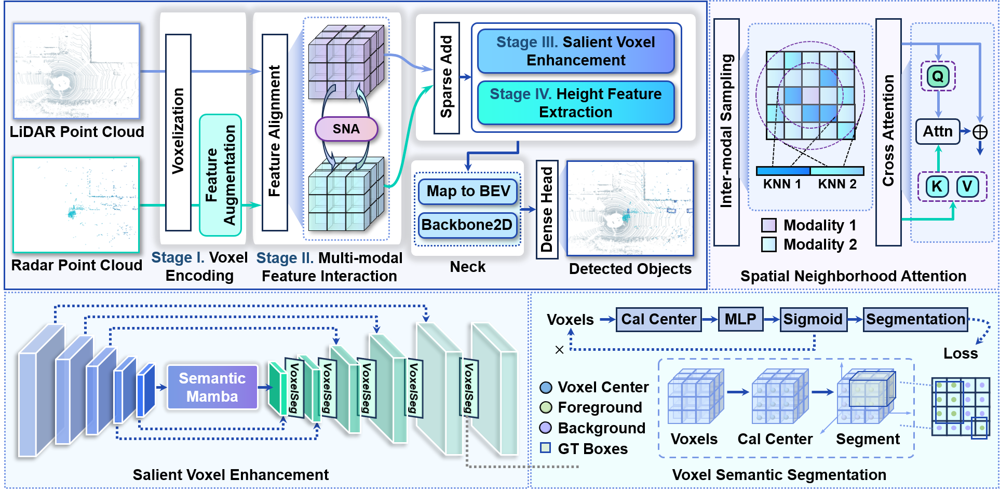
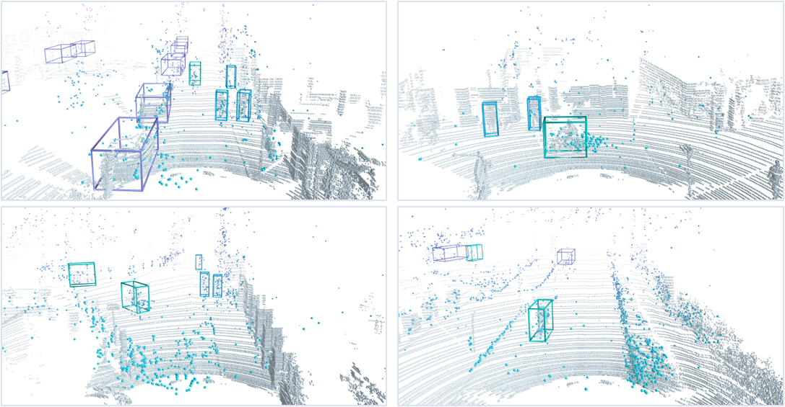

# Beyond Pillars: Advancing 3D Object Detection with Salient Voxel Enhancement of LiDAR and 4D Radar Fusion

:wave: This repository represents the official implementation of the paper titled "***Beyond Pillars: Advancing 3D Object Detection with Salient Voxel Enhancement of LiDAR and 4D Radar Fusion***". 

We present a novel voxel-based framework *SVEFusion* for LiDAR and 4D radar fusion object detection, utilizing a voxel-level re-weighting mechanism to suppress non-empty background voxels. 
Experimental results show that SVEFusion outperforms state-of-the-art methods on both the VoD and Astyx HiRes 2019 datasets.

<p align="center">
  
</p>

## 📢 News
* 2025/4/13: ✨ Code and checkpoint are released! The checkpoint is available via [Google Drive](https://drive.google.com/file/d/1O2RHHvZmj5XNFvBEhh8e3bWDWrtdhlSn/view?usp=sharing).

## 🛠️ Getting Started

### Environment Installation

#### 1. Clone the source code 
```
git clone https://github.com/icdm-adteam/SVEFusion.git
cd SVEFusion
```

#### 2. Create conda environment and set up the base dependencies
```
conda create --name svefusion python=3.8
conda activate svefusion
conda install pytorch==2.1.0 torchvision==0.16.0 torchaudio==2.1.0 pytorch-cuda=11.8 -c pytorch -c nvidia
pip install spconv-cu118
```

#### 3. Install pcdet
```
python setup.py develop
```

#### 4. Install required environment
```
pip install -r requirements.txt
```

#### 5. Install Mamba
```
cd mamba
pip install -e .
```

### Dataset Preparation
The preparation for VoD dataset mainly follows [L4DR](https://github.com/ylwhxht/L4DR).

#### 1. Dataset download
Please follow [VoD Dataset](https://github.com/tudelft-iv/view-of-delft-dataset/blob/main/docs/GETTING_STARTED.md) to download dataset.

The format of how the dataset is provided:

```
View-of-Delft-Dataset (root)
    ├── lidar (kitti dataset where velodyne contains the LiDAR point clouds)
      ...
    ├── radar (kitti dataset where velodyne contains the 4D radar point clouds)
      ...
    ├── radar_3_scans (kitti dataset where velodyne contains the accumulated 4D radar point clouds of 3 scans)
      ...
    ├── radar_5_scans (kitti dataset where velodyne contains the accumulated 4D radar point clouds of 5 scans)
      ...
```

#### 2. Data structure alignment
In order to train the LiDAR and 4D radar fusion model, LiDAR and 4D radar fusion data infos should be generated.

* First, create an additional folder with lidar and 4D radar point clouds in the VoD dataset directory (here we call it **rlfusion_5f**):

```
View-of-Delft-Dataset (root)
    ├── lidar
    ├── radar
    ├── radar_3_scans
    ├── radar_5_scans
    ├── rlfusion_5f
```

* Then, refer to the following structure to place the corresponding files in the rlfusion_5f folder:

```
rlfusion_5f
    │── ImageSets
    │── training
       ├── calib (lidar_calib)
       ├── image_2
       ├── label_2
       ├── lidar (lidar velodyne)
       ├── lidar_calib
       ├── pose
       ├── radar (single frame 4D radar velodyne)
       ├── radar_5f (radar_5_scans velodyne)
       ├── radar_calib
    │── testing
       ... like training (except label)
```

#### 3. Data infos generation
Generate the data infos by running the following command: 

```
python -m pcdet.datasets.vod.vod_dataset create_vod_infos tools/cfgs/dataset_configs/Vod_fusion.yaml
```

Finally, check if your VoD dataset has the following structure:

```
View-of-Delft-Dataset (root)
    ├── lidar
    ├── radar
    ├── radar_3_scans
    ├── radar_5_scans
    ├── rlfusion_5f
      │── gt_database
        ... 
      │── ImageSets
        ... 
      │── training
         ├── calib (lidar_calib)
         ├── image_2
         ├── label_2
         ├── lidar (lidar velodyne)
         ├── lidar_calib
         ├── pose
         ├── radar (single frame 4D radar velodyne)
         ├── radar_5f (radar_5_scans velodyne)
         ├── radar_calib
      │── testing
         ... like training (except label)
      │── vod_dbinfos_train.pkl
      │── vod_infos_test.pkl
      │── vod_infos_train.pkl
      │── vod_infos_trainval.pkl
      │── vod_infos_val.pkl
```

### Training and Testing
Go to the tools folder:

```
cd tools
```

#### 1. Train models
* To train with multiple GPUs:

```shell script
bash scripts/dist_train.sh ${NUM_GPUS} --cfg_file ${CONFIG_FILE}
```

* To train with a single GPU:

```shell script
python train.py --cfg_file ${CONFIG_FILE}
```

For example, train SVEFusion with:

```shell script
CUDA_VISIBLE_DEVICES=0,1 bash scripts/dist_train.sh 2 --cfg_file cfgs/VoD_models/SVEFusion.yaml
```

#### 2. Test and evaluate models
* To test a checkpoint:

```shell script
python test.py --cfg_file ${CONFIG_FILE} --batch_size ${BATCH_SIZE} --ckpt ${CKPT}
```

For example, test an SVEFusion checkpoint with:

```shell script
python test.py --cfg_file cfgs/VoD_models/SVEFusion.yaml --ckpt ../output/VoD_models/SVEFusion/default/ckpt/checkpoint_epoch_80.pth
```

## 🎨 Visualization
<p align="center">
  <!--  -->
  
</p>

## 🌺 Acknowledgements
Thank for the excellent 3D object detection codebases [OpenPCDet](https://github.com/open-mmlab/OpenPCDet).

Thank for the excellent spatially sparse convolution library [spconv](https://github.com/traveller59/spconv).

Thank for the excellent 4D radar dataset [VoD Dataset](https://github.com/tudelft-iv/view-of-delft-dataset/blob/main/docs/GETTING_STARTED.md) to download dataset.
